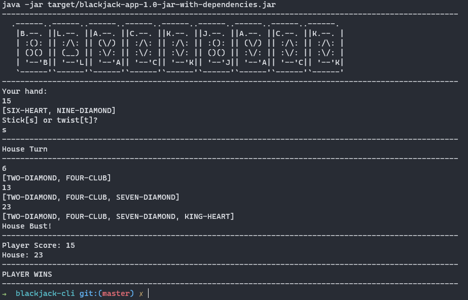

Wasn't sure whether to bundle this in as a project, but thought why not! It's a piece of code I'm quite proud of!

It was another [LeedsCodeDojo](https://leedscodedojo.github.io/) meetup, hosted at Sky Betting & Gaming. 
The challenge for the evening:

>Build a single player blackjack game that runs in a terminal.

As a result my entry is [available here](https://github.com/james-millner/blackjack-cli). I opted to attempt it in Kotlin using CliKT. It was a fun challenge!

Writing this blog post actually reminded me to update part of the Makefile! Previously the makefile used my installed version of maven.
So I've now updated it to use the wrapper I had originally intended to use.

### Requirements to run!
Clone the repo and follow:

* Easiest route:
  * Linux / Macos with a valid version of Java installed >= 8
  * run `make` and play a game of blackjack!
* Windows / Not WSL - and without going down the NMakeFile route
  * Ensure you have Java installed 
  * run `./mvnw clean package`
  * run `java -jar target/blackjack-app-1.0-jar-with-dependencies.jar`

