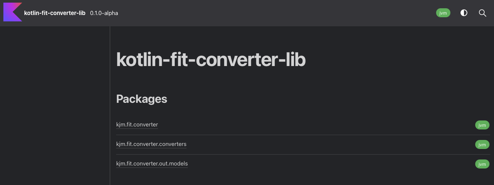
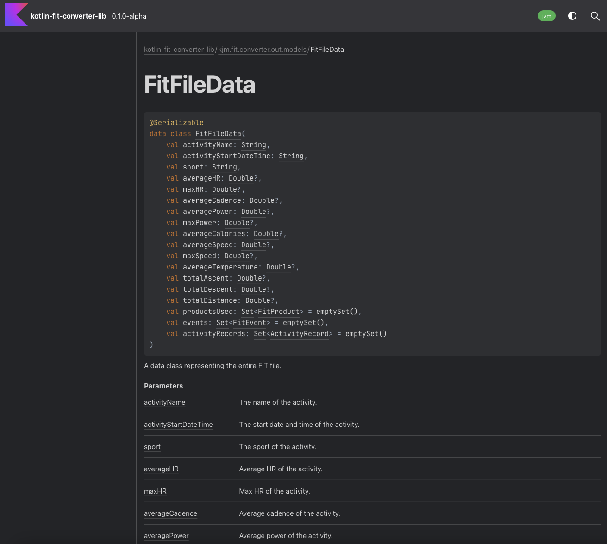

The Kotlin Fit Converter Library is a Kotlin utility for converting Garmin FIT files into different formats like JSON and Protobuf. 

It uses version 21.115.00 of the Garmin FIT SDK, which enables reading FIT files. FIT is a protocol for storing and sharing data from fitness devices. 
The library has an easy-to-use API for integrating FIT conversion into Kotlin or Java applications.
It converts to Kotlin data classes, JSON, and Protobuf. Requirements are JDK 19+, Kotlin 1.8.22+, and a FIT file to convert. Usage requires accepting the Garmin FIT SDK license agreement. 

For a full background on the library, head to my blog post it's related to [here](/blog/2023/07/08/all-things-fit-%EF%B8%8F/)

It includes:

* Handlers to convert FIT files to:
  * Kotlin Data Classes
  * JSON
  * Protobuf
* Spring-like conversion interface and a generic service. Allowing its users to create their own set of Converters for doing their own FIT conversion.
* GitHub action workflow for tests. The repository also includes Jacoco for test coverage reports and Maven for publishing to local / Github Packages.
* Dokka generated docs

 
Technology Used:

* Gradle Library Project
* Garmin FIT SDK 
  * Version: 21.115.00
* KotlinX Serialization
* Automated workflow to build / publish new versions
* Dokka documentation 

The source code for the library can be found here: [https://github.com/james-millner/kotlin-fit-converter](https://github.com/james-millner/kotlin-fit-converter)
