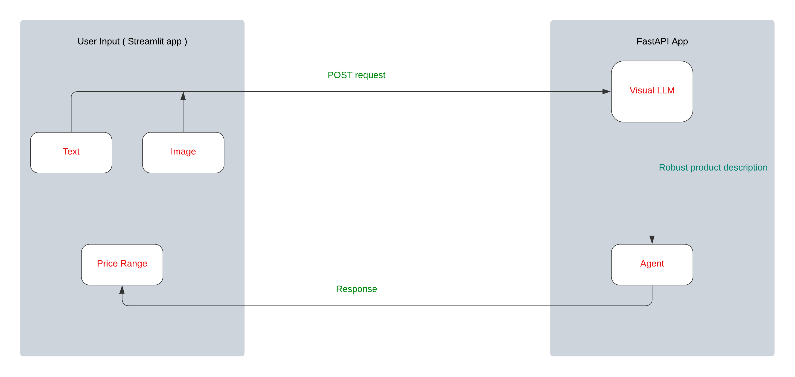

The Price Discovery project harnesses the power of FastAPI, Streamlit, a Visual Large Language Model (VLLM), and an agent to efficiently determine the price range of a product based on its image and text description. This project is designed to offer a user-friendly interface for precise and efficient product price discovery using state-of-the-art natural language processing techniques.

Here's how it works: Users input a product image and its description into the Streamlit app. Upon submission, a POST request is sent to the FastAPI app where the pipeline is initiated. The product image is analyzed by the visual VLLM to extract detailed information about the product. These details are then combined with the description to create a more comprehensive product overview.

Next, this enhanced description is passed to an agent equipped with three tools: searching the internet, searching image databases, and searching text databases. The agent conducts these searches to identify similar products and then determines a price range based on its findings and comparison to similar products. Once completed, the agent returns the price range along with the rationale behind it to the user.

Technology Used:

* Google Gemini
* ChatGPT
* langchain
* langsmith
* Streamlit
* Jupyter notebook
* Docker
* FASTAPI

The source code for the library can be found here: [https://github.com/treylonwofford/price_discovery](https://github.com/treylonwofford/price_discovery)
